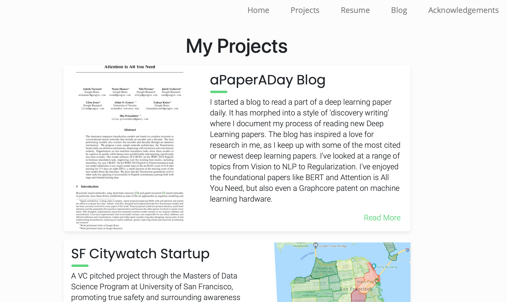

# www.lukethomas.ai

----

This is the code for my personal portfolio.  I originally got the code from [here](https://github.com/crearo/portfolio) and adapted it to my preference.

# Technology

* Developed using Python Flask, and a lot of CSS and Jinja2.
* Currently hosted on AWS through Elastic Beanstalk with a CI pipeline. 
* The Domain was purchased from Namecheap.

# I want to use this!

You're free to use this for your own personal portfolio; but please write the original author [rish](https://github.com/crearo/portfolio) to let him know you've benefitted from his work.

